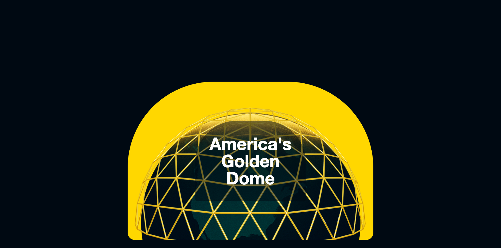
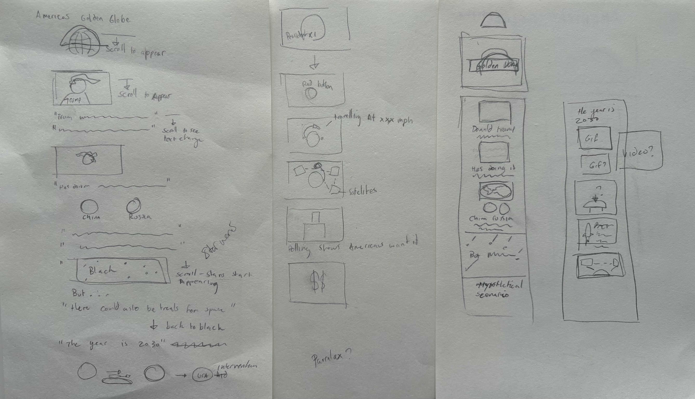

## Golden Dome Project:

### The Project:

The goal of this project was to transform a piece of hypothetical text into a compelling piece of visual storytelling.

I chose to use vanilla JavaScript for this project to take a break from frameworks. Although I experimented with a Vite setup in a separate repo, I ultimately decided to keep things simple. I used GSAP to animate shapes, text, and images, and ran the project locally using the Live Server extension.

### Inspiration:

- [New York Times](https://www.nytimes.com/projects/2012/snow-fall/index.html#/?part=tunnel-creek)

- The Times - 7 / 7 Article

- [Codegri - youtube tutorials](https://www.youtube.com/@codegri)

### Layout Ideas:

I started by sketching out rough layout ideas and experimenting with different animation concepts. I actually had two other versions going, one with heavier use of parallax and another with alternative animation styles. It was tough to decide which direction to go, but I’m happy with the final choice.

### Challenges:

- Opening dome animation, Getting the stylisation and motion to feel right took a lot of iteration.

- Mobile layout issues, Ensuring the rocket animation didn’t cover the text on mobile was tricky. Chrome's iPhone preview isn’t entirely accurate, so I’ll likely need to use a full emulator for proper mobile testing.

### Potential Improvements:

- The middle section relies too heavily on flat images, replacing them with motion graphics or video would make it more engaging.

- Animated data visualizations or graphs could add depth and interactivity.

- The outro could use a bit more visual flair or narrative payoff.

### Final Thoughts:

I really enjoyed working on this task, especially diving into GSAP and exploring just how expressive the web can be. Creating some of the assets was genuinely fun, and I was particularly happy with how the golden Trump image turned out. This project was a great mix of code, visual storytelling, and animation, all things I’m deeply inspired by and want to explore more in the future.